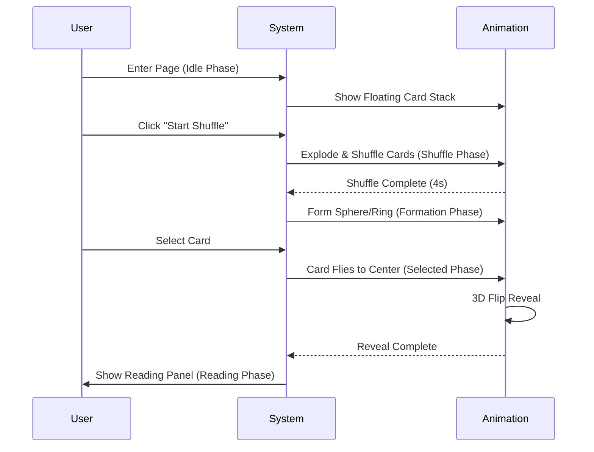
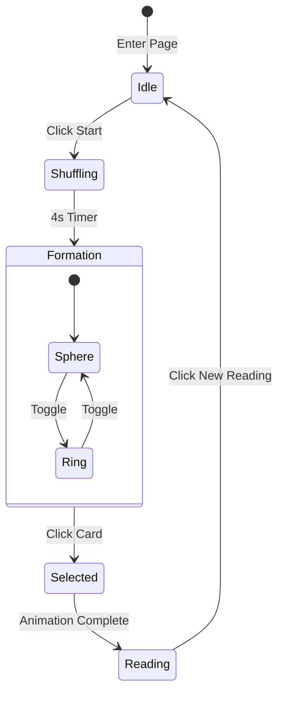

# AI Love Tarot Sphere 🔮

一个沉浸式、仪式感的 AI 爱情塔罗占卜 Web 应用，融合赛博魔法美学、3D 动效、神圣几何元素。

An immersive, ritual-style AI Love Tarot divination web application that combines cyber-magic aesthetics, 3D animations, and sacred geometry elements.

---

## 🎨 核心特性 | Core Features

### 1. 视觉设计系统 | Visual Design System

#### 主题 | Theme

- **赛博魔法** - Cyber Magic aesthetic with neon energy
- **神圣几何** - Sacred geometry patterns throughout
- **深空星空** - Deep space starfield background with cosmic dust
- **霓虹能量** - Neon energy trails and glow effects

#### 配色方案 | Color Palette

- 霓虹粉 (Neon Pink): `#FF4FD8` - Primary brand color
- 霓虹青 (Neon Cyan): `#73F2FF` - Secondary accent color
- 深空紫 (Deep Purple): `#1a0a2e`, `#0f0a20` - Background depths
- 星光白 (Starlight): `rgba(255, 255, 255, 0.8)` - Foreground elements

---

### 2. 五阶段占卜动画流程 | Five-Phase Divination Flow

#### 流程概览 | Flow Overview



#### Phase A: 待机阶段 (Idle Phase)

**视觉呈现 | Visual Presentation:**
- 屏幕中央显示 3D 层叠卡牌堆
- 卡牌带有轻微上下漂浮动画 (floating animation)
- 卡牌周围有呼吸脉冲光效 (breathing pulse glow)
- 背景星空缓慢移动

#### Phase B: 洗牌阶段 (Shuffle Phase)

**视觉呈现 | Visual Presentation:**
- 卡牌以随机方向爆炸式飞散
- 每张卡牌带有 3D 旋转、翻转、偏移
- 运动轨迹带粉青渐变能量尾迹
- 背景粒子场强度提升至 2 倍
- 魔法阵进行强烈脉冲和旋转

#### Phase C: 阵法展示 (Formation Phase)

**两种布局模式 | Two Formation Modes:**

1.  **球体阵列 (Sphere Formation)**: 22 张塔罗牌均匀分布在 3D 球体表面，球体缓慢自转。
2.  **环形阵列 (Ring Formation)**: 卡牌组成 360° 圆环，中心悬浮魔法阵，环整体带微小上下震动。

#### Phase D: 抽卡阶段 (Card Selection)

**交互流程 | Interaction Flow:**
1.  用户点击阵法中的任意卡牌
2.  卡牌脱离阵法位置
3.  飞向屏幕中央 (带光迹)
4.  到达后进行 3D 翻面动画
5.  其他卡牌保持静默

#### Phase E: 解读阶段 (Reading Phase)

**视觉呈现 | Visual Presentation:**
- 解读面板从右侧滑入，带有玻璃拟态效果 (Glassmorphism)。
- 内容包含：卡牌标题、关键词、爱情状况分析、未来趋势、指导建议。

---

### 3. 背景与特效系统 | Background & Effects System

#### 神圣几何星空背景 | Sacred Geometry Starfield
- **渐变背景**: 深空紫到黑色的径向渐变。
- **星星粒子**: 600+ 动态闪烁的星星。
- **宇宙尘埃**: 漂浮的星云效果。

#### 魔法阵系统 | Magic Circle System
- **双层旋转**: 外圈顺时针，内圈逆时针旋转。
- **呼吸脉冲**: 根据当前阶段调整脉冲强度 (洗牌时最强)。

#### 粒子场系统 | Particle Field System
- **动态生成**: 随机位置、大小、生命周期的粒子。
- **阶段响应**: 洗牌阶段粒子数量翻倍。

---

### 4. 状态管理与用户旅程 | State Management & User Journey



---

## 🛠 技术栈 | Tech Stack

- **框架 | Framework:** Next.js 15 (App Router)
- **动画库 | Animation:** Framer Motion
- **样式 | Styling:** Tailwind CSS v4
- **类型 | Types:** TypeScript

---

## 📦 项目结构 | Project Structure

```
tarot-sphere-prototype/
├── app/                 # 页面与布局
├── components/          # UI 组件
│   ├── tarot-sphere.tsx # 主控制器
│   ├── magic-*.tsx      # 背景与特效
│   └── *-phase.tsx      # 各阶段组件
└── public/              # 静态资源
```

---

## 🎯 核心动效总结 | Core Animations Summary

| 动效 | 描述 | 关键特征 |
|------|------|---------|
| **卡牌漂浮** | 待机时的轻微浮动 | 垂直位移 + 微旋转 |
| **洗牌爆炸** | 混乱的飞散效果 | 随机位置 + 3D 旋转 |
| **球体分布** | 斐波那契球体算法 | 均匀分布在球面上 |
| **3D 翻牌** | 卡牌正反面切换 | Y轴旋转 180 度 |
| **能量尾迹** | 运动时的拖尾效果 | 渐变色 + 消失动画 |

---

## 📄 License

MIT License - 自由使用与修改 | Free to use and modify

---

## 🙏 致谢 | Acknowledgments

- 设计灵感源于赛博朋克美学与古典塔罗艺术的融合
- 动画实现参考了现代 Web 动效最佳实践
- 感谢 Framer Motion 提供优秀的动画库

Design inspired by the fusion of cyberpunk aesthetics and classical tarot art. Animation implementation references modern web animation best practices. Thanks to Framer Motion for the excellent animation library.
